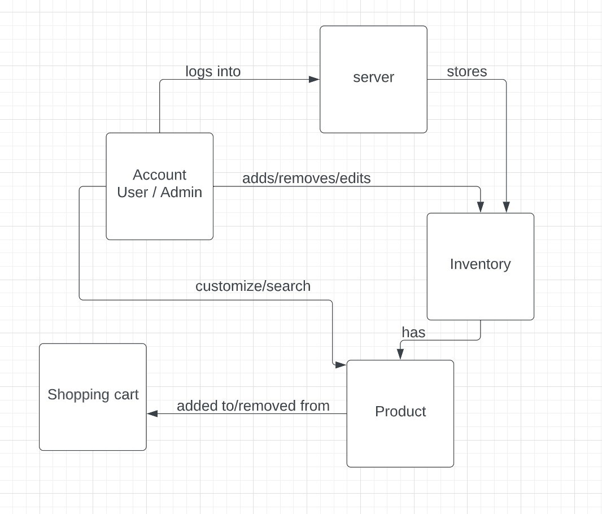
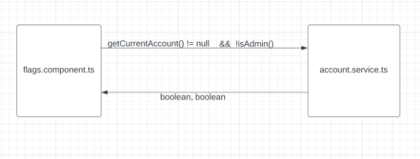
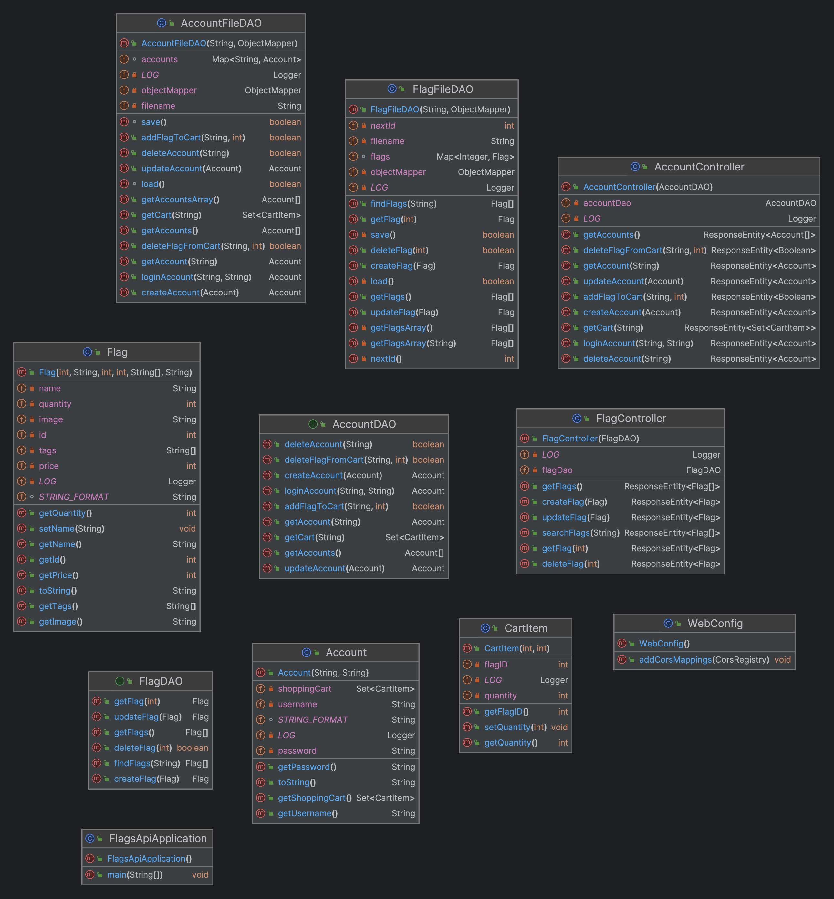

# PROJECT Design Documentation

## Team Information
* Team name: 6f
* Team members
  * Kelly Feke
  * Jack Sebben
  * Oliver Vinneras
  * Kerri Walsh

## Executive Summary

This project involves a backend and frontend implementation of a flag E-store, where users can purchase and customize flags and the owner can edit their inventory. The backend, titled Flags_API, uses model, controller, and persistence tier structure to implement the workings on the E-store. In these tiers are classes that implement the inventory and deal with flag objects. The entire backend is written in Java. The frontend, titled Tour-of-Flags, utilizes Angular and Maven to create the connection to the backend and implement the site interface. It utilizes component and service structure by Maven. The frontend is written in Typescript, HTML, and CSS.

### Purpose
The purpose of this project was to fully design, implement, and test the frontend and backend of a webstore, following software design standards and principles.

### Glossary and Acronyms

| Term | Definition |
|------|------------|
| TS | Typescript |
| CSS | Cascading Style Sheets |
| HTML | Hypertext Markup Language |
| MVP | Minimum Viable Product |

## Requirements

This section describes the features of the application.

### Definition of MVP
The MVP includes minimal authentication for customer and e-store owner to login and logout, customer functionality for purchasing flags, inventory management, data persistence, and two extra 10% features which for this project were flag tags for filtered search and customizable flags for the user. 

### MVP Features
Users should be able to login with a username and password. If they are a customer, they will have a customer login so they can be brought to their own page with their own shopping cart. If they are the owner, they will have an admin login. 
The customers should be able to view and search the inventory of flags, add and remove flags from their shopping cart, and proceed to checkout to purchase the flags. 
The owner of the e-store should be able to add, 

### Roadmap of Enhancements
Flags should also be equipped with filters. The owner should be able to add and remove filters from a flag. Users should be able to see a list of filters on the flags page, and they should be able to select the filters in order to narrow down the amount of flags. It was decided that the filters for the flags would be the flag colors.
Users should be able to create their own custom flags and purchase it, accordingly. One can select specific options and pick from various shapes/templates for their custom flag. We originally planned to make it so that users can save their custom flags, but we believed that was out of scope for us.

## Application Domain

The domain model starts with the user in the Account class. The user interacts with the server and can login as either the admin of the E-store or a customer. The server stores the products in the inventory of the E-store, which in our project are flags. The admin can edit this inventory, adding or removing products as desired. The customer can search through the products in the inventory. The customer also has a shopping cart that they can add products to or remove products from.

## Architecture and Design

This section describes the application architecture.

### Summary

The following Tiers/Layers model shows a high-level view of the webapp's architecture.

The e-store web application is built using the Model–View–ViewModel (MVVM) architecture pattern.

The Model stores the application data objects including any functionality to provide persistence.

The View is the client-side SPA built with Angular utilizing HTML, CSS and TypeScript. The ViewModel provides RESTful APIs to the client (View) as well as any logic required to manipulate the data objects from the Model.

Both the ViewModel and Model are built using Java and Spring Framework. Details of the components within these tiers are supplied below.

### Overview of User Interface

This section describes the web interface flow; this is how the user views and interacts
with the e-store application.

When the application opens, the user is brought to the dashboard. This is the main page of the application. Here, the user can view the top flags, create or login to an account, search for a specific flag using the search bar, and create and save a custom flag. When pressing on the Flags button, the current webstore inventory will be displayed. Each flag displays the price, current inventory quantity, and a picture of the flag. These details can also be shown when the user clicks on the flag name. If a user is logged in, they can add flags to the cart. If they click on the shopping cart button, the user will see the contents of their shopping cart, which they can buy using the checkout button.

### View Tier

The view tier of our architecture is the user interface, made up of several sets of classes, each responsible for a single component. Each component has an html class and a css class. The classes are responsible for displaying the component, and displaying the component, respectively. The app.component classes are responsible for the welcome message and navigation menu at the top of all pages. The homepage is made up of the dashboard.component classes and this component displays the top products, the search bar, and the custom button. The flags display tab is its own component and it displays the flags in a grid and includes an add to cart button. 

The user can also click on the name of the flag to see details, displayed by flag-detail.component. There is also a component for the shopping cart, login, and register. 

### ViewModel Tier
The ViewModel tier refers to the classes that communicate between the view tier and the model tier. This would refer to the typescript classes that handle computation and the storing of information. Every component has a typescript file that can communicate with other components to display various data, for example the flags.component that displays the flags in the browse tab, communicates with the account typescript file to check if a user is logged in and displays the add to cart button accordingly. This tier also consists of the java controller files FlagController.java and AccountController.java that handle http requests. 

### Model Tier
The model tier refers to the back-end of the architecture. These classes are written in java and store data so that our product has data persistence. They load data from json files, and write to these files when data is changed. The files that handle these duties are DAO files and include AccountDAO, AccountFileDAO, FlagDAO, and FlagFileDAO. The files that store information when the program is running and send out data are java files. They include Account.java, Flag.java, and CartItem.java. 

### Static Code Analysis/Design Improvements

Some improvements we would make to the project include perfecting the CSS and how the website looks. We also have some small bugs that are not visible on the website but affect some of the frontend components that we would fix.

Our Static Code Analysis exercise showed that we had 9 total bugs in our combined frontend and backend code. Some of these bugs correlated with the bugs that we want to fix. We also had a significant amount of code smells in both the frontend and the backend. If we fixed these, it would make our code look better and more readable thus making it easier to change how the website looks.

## Testing
This section will provide information about the testing performed and the results of the testing.

### Acceptance Testing
We had 28 different user stories that passed their acceptance criteria test. There was only 1 user story that did not pass. This was because it was for a feature that we ended up not implementing, which was saving a custom flag to a user’s account. There were no issues during acceptance testing. Our application at the time of the testing was working as expected, with practically no issues. The only issues were from our custom flag feature, which still works, but had some bugs thanks to the newness of the feature.

### Unit Testing and Code Coverage
Our unit testing strategy was to ensure that all of our code was tested. We focused mostly on testing the many different methods of our backend to ensure that everything on that front was working as intended. We had about 60-70 different unit tests in total for our entire application. Our code coverage percentage from our static code analysis was about 88%. I’d say that’s a pretty good marker. Although we were shooting for at least about 90%, I’d say with all of our team’s difficulties in completing the application, our recorded code coverage is pretty good. We selected a target of 90% since that still covers most of our code, but also gives ourselves realistic expectations for any minor sections we may have missed; according to our results, I’d say our reasoning for our target was pretty accurate. Our code analysis also showed a few small bugs and code smells, but for the most part there were no significant errors.
